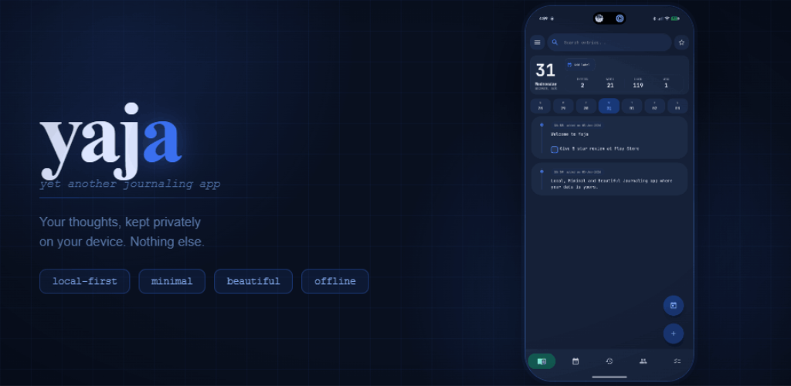

<p align="center">
  
</p>

# Yaja (Yet Another Journaling App)

<a href="https://play.google.com/store/apps/details?id=com.mj.yaja">
  
</a>

Yaja is a privacy-first, markdown-based personal journaling application for Android. Built with Kotlin and Jetpack Compose, Yaja treats your journal entries as actionable records—merging text capture, inline tasks, location/people tracking, and rich automated insights into a single unified flow.

---

## 🌟 Specialties of Yaja

* **Privacy-First & 100% Local:** All journal entries, stats, and language analytics reside strictly on your physical device. Yaja has no cloud databases, tracking SDKs, or remote backup servers. Your thoughts remain yours.
* **Standard Markdown Storage:** Entries are stored as standard, human-readable `.md` files organized by year and month. You own your data and can view it in any text editor.
* **Actionable Journaling:** Instead of segregating notes, tasks, and calendar events, Yaja integrates them. Write inline checklist items `[ ]` or designate whole entries as native `Events` right inside your daily logging.
* **Extensive Android Integrations:** Log thoughts on-the-go with launcher widgets, Home screen shortcuts, and a robust Tasker integration to automate logging from external system events.

---

## 🛠 Key Features

### 1. Writing Flow & Templates
* **Dynamic Templates:** Create structured logs using preset templates like *Meeting Note, Travel Day, Health Log, Reflection, or Work Log*. Templates can be appended, inserted at the cursor, or replace the entire draft.
* **Markdown Heading Support:** Organise entries with standard markdown headings (e.g., `### Section`) which render beautifully in both View and Edit modes.
* **Shortcodes:** Create custom abbreviations that expand into long snippets, complete with dynamic placeholders like `{{today:dd-MMM}}` and `{{now:HH:mm}}`.

### 2. Actionable Tasks & Events
* **Inline Todos:** Write tasks directly in entries using standard markdown `[ ]` and `[x]`.
* **Native Events:** Mark any entry as an `Event` to designate family plans, reminders, travel, and appointments.
* **Dedicated Todos Screen:** Track, filter, and manage open/completed tasks and events without turning your journal into a distracting productivity board.
* **Chronological Widgets:** Pin your checklist and event list to your Home screen with custom layouts, auto-hide options, and toggle confirmations.

### 3. Smart Post-Write Review & Revisits
* **Post-Write Review Sheet:** After saving, a review sheet prompts you to extract todos, detect keywords (people/places), star the day, set a day label, or schedule revisit dates.
* **Linked Revisit Dates:** Set follow-up reminders (e.g., *Tomorrow*, *Next Week*, *Next Month*, or a custom date). Due revisits surface on your Home timeline and calendar.

### 4. Deep Insights & Lookbacks
* **People & Places Tracking:** Detects people and places with aliases and relationship labels. The keywords view shows mention frequencies, co-mentions, and ranked connections.
* **On This Day Lookback:** Rediscover entries from the same day in past years, view starred highlights, or use *Surprise Me* to open a random entry.
* **Compare Mode Statistics:** Visualize writing habits, word count trends, template usage, and keyword deltas. 
* **Local Script/Language Analytics:** Detects dominant scripts/languages in your writing to present in your reviews—completely offline.

### 5. Advanced Configuration & Security
* **Material 3 Theming:** Customize your look with dynamic Material 3 colors, custom themes, color intensity, and background tint controls.
* **Version History Backups:** Automated file versioning keeps safe snapshots of your journal before edits, deletions, or label changes to prevent accidental data loss.
* **App Lock:** Secure your journal from prying eyes using PIN and fingerprint authentication.

---

## 🚀 Development & Build Instructions

### Prerequisites
* **Android SDK** (API Level 33+)
* **JDK 17**
* **Gradle 8.0+**

### Building the App
To compile and build the debug APK locally, run:
```bash
./gradlew assembleDebug
```
The resulting APK will be located in `app/build/outputs/apk/debug/`.

---

## 📥 Importing External Journals

Yaja includes an import utility supporting standard exports from **Day One** and **Journalistic**.

### Steps to Test Import:
1. Push your JSON export file to the device storage via ADB:
   ```bash
   adb push /path/to/Journal.json /sdcard/Download/Journal.json
   ```
2. Open Yaja and navigate to **Settings > Data & Storage > Import**.
3. Tap the **Day One** or **Journalistic** row.
4. Locate and select the file from `/sdcard/Download/` using the system file picker.
5. A progress bar will track the import process. 
6. Ensure that the active storage location in **Settings > Data & Storage > Storage Location** has write permissions (via the Storage Access Framework picker) so Yaja can write the imported markdown files.

---

## 📄 License
This project is proprietary and maintained by [rjwarrier](https://github.com/rjwarrier).
