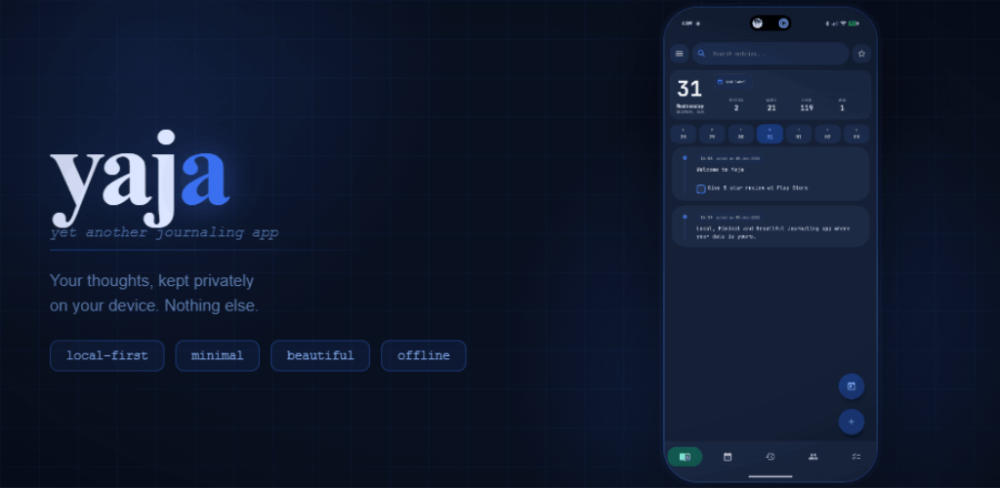

<p align="center">
  
</p>

<h1 align="center">Yaja</h1>

<p align="center">
  <strong>Yet Another Journaling App</strong><br />
  A privacy-first, markdown-based personal journal for Android.
</p>

<p align="center">
  
  
  
  
  
</p>

<p align="center">
  <a href="https://play.google.com/store/apps/details?id=com.mj.yaja">
    
  </a>
</p>

<p align="center">
  <a href="https://www.ranjithj.in/yaja/">Website</a> ·
  <a href="#-features">Features</a> ·
  <a href="#-building-from-source">Build</a> ·
  <a href="#-importing-external-journals">Import</a> ·
  <a href="#-support-the-developer">Support</a>
</p>

---

## About

Yaja treats journal entries as actionable records. Text capture, inline tasks, people and place tracking, and automated insights live in one flow, stored as plain markdown files on your own device. Built with Kotlin and Jetpack Compose.

> [!IMPORTANT]
> **Yaja is not** a productivity app, a standard todo app, or a general-purpose calendar.
>
> **Yaja is** a private, personal space to manage your life, capture thoughts, and track tasks with no fear of your data being uploaded, processed, or shared in the cloud. Everything stays offline on your device.

## ✨ Highlights

| | |
| --- | --- |
| 🔒 **Privacy-first, 100% local** | Entries, stats, and language analytics stay on your device. No cloud database, tracking SDKs, or remote backup servers. |
| 📝 **Standard markdown storage** | Entries are human-readable `.md` files organized by year and month. Open them in any text editor. |
| ✅ **Actionable journaling** | Write inline checklist items `[ ]` or mark whole entries as `Events` right inside your daily log. |
| 📱 **Deep Android integration** | Launcher widgets, home screen shortcuts, and Tasker support for automated logging. |

## 🛠 Features

<details open>
<summary><strong>Writing flow & templates</strong></summary>

- **Dynamic templates** — Meeting Note, Travel Day, Health Log, Reflection, Work Log, and more. Append, insert at the cursor, or replace the draft.
- **Markdown headings** — Organize entries with `### Section` headings, rendered in both View and Edit modes.
- **Shortcodes** — Custom abbreviations that expand into snippets, with placeholders like `{{today:dd-MMM}}` and `{{now:HH:mm}}`.

</details>

<details open>
<summary><strong>Tasks & events</strong></summary>

- **Inline todos** — Standard markdown `[ ]` and `[x]` directly in entries.
- **Native events** — Mark any entry as an `Event` for plans, reminders, travel, and appointments.
- **Todos screen** — Filter and manage open and completed tasks without turning your journal into a productivity board.
- **Widgets** — Pin checklists and events to your home screen with custom layouts, auto-hide, and toggle confirmations.

</details>

<details open>
<summary><strong>Post-write review & revisits</strong></summary>

- **Review sheet** — After saving, extract todos, detect people and places, star the day, set a day label, or schedule revisits.
- **Linked revisit dates** — Tomorrow, next week, next month, or a custom date. Due revisits surface on your timeline and calendar.

</details>

<details open>
<summary><strong>Insights & lookbacks</strong></summary>

- **People & places** — Aliases and relationship labels, with mention frequencies, co-mentions, and ranked connections.
- **On This Day** — Entries from the same day in past years, starred highlights, and *Surprise Me* for a random entry.
- **Compare mode** — Writing habits, word count trends, template usage, and keyword deltas.
- **Script & language analytics** — Detects dominant scripts and languages in your writing, fully offline.

</details>

<details open>
<summary><strong>Customization & security</strong></summary>

- **Material 3 theming** — Dynamic color, custom themes, color intensity, and background tint.
- **Version history** — Automatic snapshots before edits, deletions, or label changes.
- **App lock** — PIN and fingerprint authentication.

</details>

## 🚀 Building from source

**Requirements**

- JDK 17
- Android SDK with API 36 (compile target; runs on Android 8.0 / API 26+)
- Gradle 9 (the wrapper is included)

**Build a debug APK**

```bash
./gradlew assembleDebug
```

The APK is written to `app/build/outputs/apk/debug/`.

## 📥 Importing external journals

Yaja can import exports from **Day One** and **Journalistic**.

1. Push your JSON export to the device:
   ```bash
   adb push /path/to/Journal.json /sdcard/Download/Journal.json
   ```
2. In Yaja, open **Settings › Data & Storage › Import**.
3. Tap **Day One** or **Journalistic**.
4. Pick the file from `/sdcard/Download/` in the system file picker.
5. A progress bar tracks the import; you can cancel at any time.

> [!NOTE]
> Imported entries are written to the active storage location (**Settings › Data & Storage › Storage Location**). If that is a custom folder such as Google Drive or an SD card, make sure it was granted write access through the folder picker.

## 💖 Support the developer

If Yaja helps you keep your personal logs private and offline, consider supporting its development.

<p>
  <a href="https://www.buymeacoffee.com/ranjithj">
    
  </a>
</p>

You can also donate via **[Razorpay](https://pages.razorpay.com/ranjithj)**.

## 📄 License

This project is proprietary and maintained by [@rjwarrier](https://github.com/rjwarrier).
